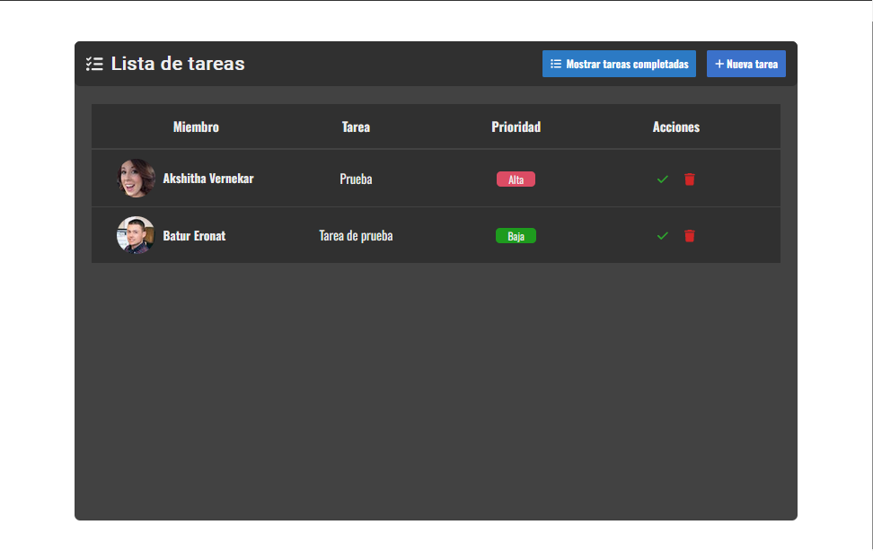
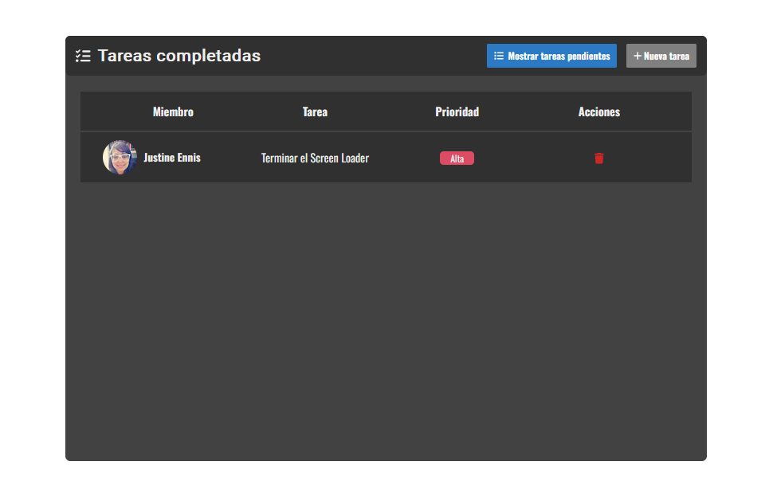
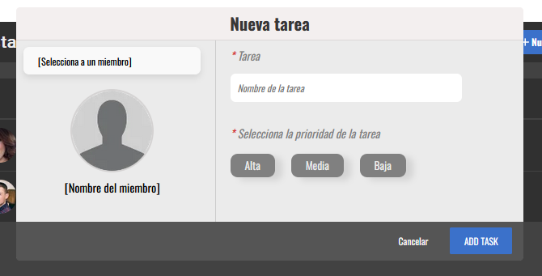
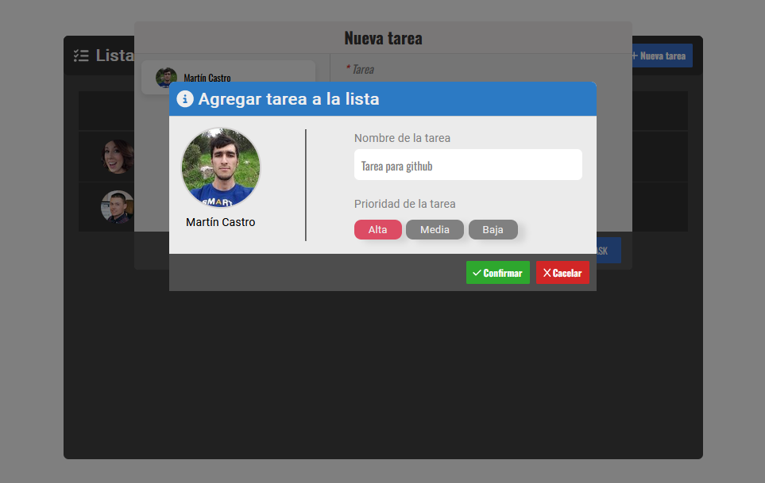
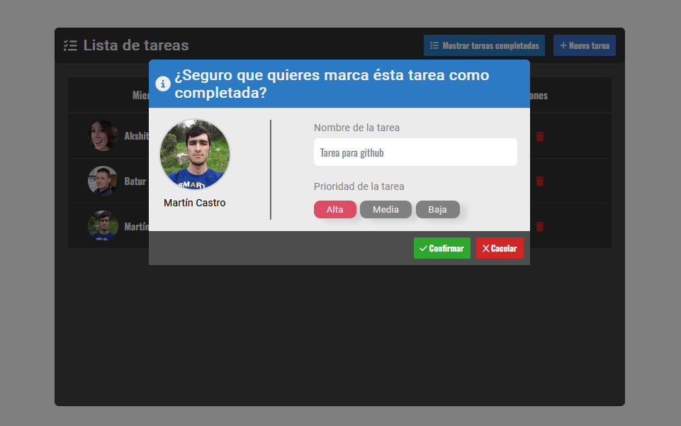
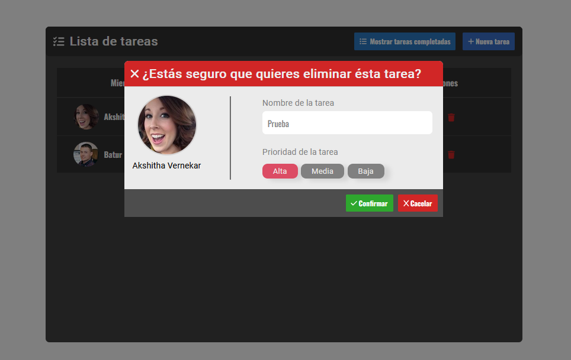
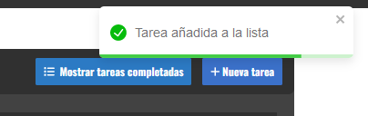
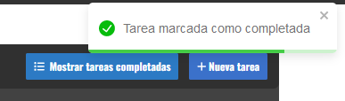
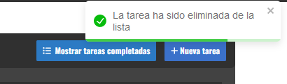
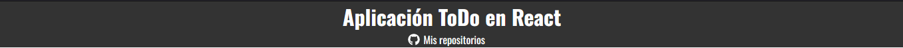

#  Aplicación de Lista de Tareas

Esta es una aplicación simple de lista de tareas que te permite gestionar tus tareas por hacer. Puedes añadir nuevas tareas, marcarlas como completadas y eliminarlas.

## Funcionalidades

### Contenedor Todo

- **Header:** Muestra el título de la aplicación.
- **Botón Mostrar Completadas:** Permite mostrar u ocultar las tareas completadas.
- **Botón Añadir Tarea:** Abre el formulario para añadir una nueva tarea.

### Lista de Tareas

- Muestra todas las tareas por hacer.
- Cada tarea tiene:
  - **Miembro:** Foto y nombre del miembro encargado.
  - **Tarea:** Nombre de la tarea.
  - **Prioridad:** Indicada por colores: Alta (rojo), Media (naranja), Baja (verde).
  - **Acciones:** Botones para marcar como completada y eliminar la tarea.

### Lista de Tareas Completadas

- Muestra las tareas que han sido marcadas como completadas.
- Cada tarea tiene un botón para eliminarla.

### Formulario para Agregar Tareas

- **Header:** Título "Nueva Tarea".
- **Cuerpo:** Dos secciones, una para seleccionar al miembro y otra para el nombre de la tarea y su prioridad.
- **Footer:** Botones para cancelar y agregar la tarea.

### Modal de Confirmación

- Se muestra al realizar operaciones como agregar tarea, marcar como completada y eliminar tarea.

  
  
  

### Toast

- Utiliza la librería `react-toastify` para mostrar notifiaciones sobre las operaciones confirmadas.

  
  
  

### Librería 'react-header-watermark'

- Muestra un header en la parte superior de la aplicación con el título del proyecto y un enlace a los repositorios de GitHub.

## Almacenamiento

- Utiliza el local storage para almacenar las tareas por hacer y las tareas completadas.

## Tecnologías Utilizadas

<ul class="technologies">
  <li>
    
    HTML
  </li>
  <li>
    
    CSS
  </li>
  <li>
    
    React
  </li>
  <li>
    
    Yarn
  </li>
  <li>
    
    Vite
  </li>
</ul>

## Créditos

- **Autor:** [JuanBlancodev](https://github.com/JuanBlancodev) 
- **Repositorios en github:** [Ver](https://github.com/JuanBlancodev?tab=repositories)

