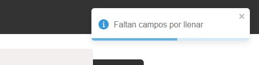

#  Aplicación de Lista de Tareas

Esta es una aplicación simple de lista de tareas que te permite gestionar tus tareas por hacer. Puedes `añadir nuevas tareas`, `marcarlas como completadas` y `eliminarlas`.

## Funcionalidades

### Contenedor de tareas

- **Cabecera:** Muestra el título de la aplicación.
- **Botón Mostrar Completadas:** Permite mostrar u ocultar las `tareas completadas`.
- **Botón Añadir Tarea:** Abre el formulario para `añadir una nueva tarea`.

### Lista de Tareas

- Muestra todas las tareas por hacer.
- Cada tarea tiene:
  - **Miembro:** Foto y nombre del miembro encargado.
  - **Tarea:** Nombre de la tarea.
  - **Prioridad:** Indicada por colores: `Alta (rojo)`, `Media (naranja)`, `Baja (verde)`.
  - **Acciones:** Botones para marcar como completada y eliminar la tarea.


### Lista de Tareas Completadas

- Muestra las tareas que han sido marcadas como completadas.
- Cada tarea tiene un botón para eliminarla.


### Formulario para Agregar Tareas

- **Header:** Título "Nueva Tarea".
- **Cuerpo:** Dos secciones, una para seleccionar al miembro y otra para el nombre de la tarea y su prioridad.
- **Pie:** Botones para cancelar y agregar la tarea.


### Modal de Confirmación

- Se muestra al realizar operaciones como agregar tarea, marcar como completada y eliminar tarea.


### Toast

- Utiliza la librería `react-toastify` para mostrar notifiaciones sobre las operaciones confirmadas.




### Librería 'react-header-watermark'

- Muestra un header en la parte superior de la aplicación con el título del proyecto y un enlace a los repositorios de GitHub.


## Almacenamiento

- Utiliza el local storage para almacenar las tareas por hacer y las tareas completadas.

# Demo

- Puedes ver una **Demo** en vivo [presionando aquí](https://juanblancodev.github.io/todo-app-react/)

# Clonar el proyecto
Si deseas trabajar en este proyecto de forma local, puedes seguir estos pasos para clonarlo en tu PC:

1. Abre tu términal si estás en `Linux/Mac` o el CMD si estás en `Windows`
2. Navega hacia la carpeta en donde quieres clonar el proyecto
3. Copia el enlace del repositorio haciendo clic en el botón "Code" en GitHub y luego copiando la URL que se muestra
4. Usa el comando `git clone` y coloca la URL que copiaste como parámetro
   ```sh
   git clone https://github.com/JuanBlancodev/todo-app-react.git
   ```
5. Presiona **Enter** para ejecutar el comando y espera que el proyecto se clone por completo
6. Navega hacia la carpeta del proyecto clonado
   ```sh
   cd todo-app-react
   ```
7. Instala las dependencias del proyecto con tu manejador de paquetes
   ```bash
   npm install
   ```
   o
   ```bash
   yarn install
   ```
8. Ahora puedes trabajar en el proyecto de manera local

## Tecnologías utilizadas

<ul style="list-style:none; display: flex; gap: 15px;font-weight: bold;">
  <li style="display: flex; align-items: center; gap: 5px;">
    
    <a href="https://html.spec.whatwg.org/" target="_blank">HTML</a>
  </li>
  <li style="display: flex; align-items: center; gap: 5px;">
    
    <a href="https://www.w3.org/Style/CSS/" target="_blank">CSS</a>
  </li>
  <li style="display: flex; align-items: center; gap: 5px;">
    
    <a href="https://es.react.dev/" target="_blank">React</a>
  </li>
  <li style="display: flex; align-items: center; gap: 5px;">
    
    <a href="https://yarnpkg.com/" target="_blank">Yarn</a>
  </li>
  <li style="display: flex; align-items: center; gap: 5px;">
    
    <a href="https://vitejs.dev/" target="_blank">Vite</a>
  </li>
</ul>

## Créditos

- **Autor:** [JuanBlancodev](https://github.com/JuanBlancodev)<br>
- **Repositorios en github:** [Ver](https://github.com/JuanBlancodev?tab=repositories)